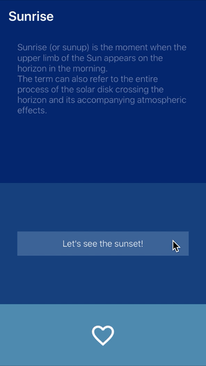

# SuitUp
[](https://github.com/apple/swift)
[](https://opensource.org/licenses/Apache-2.0)

## Introduction
Easy to use and lightweight theme manager for iOS applications written in Swift with UIKit, but taking advantages of Objective-C reflection capabilities.

Repository also contains an Example app, which helps you to define themes and styles in a protocol oriented way.



## Example
Just open `SuitUp workspace` and have fun!

## Installation
Use [CocoaPods](https://cocoapods.org):
```ruby
pod 'SuitUp'
```

or you can install manually:

Download it, then drag and drop the contents of `SuitUp/SuitUp` folder into your project.
### Import
Of course don't miss to import **SuitUp** where you want to use.
```swift
import SuitUp
```

## Themes
A theme contains color, font and image definitions based on the design, but you can extend it with anything you need.
In **SuitUp** you can change between these themes, like the usual light and dark modes.

### Colors, fonts and images
The base theme contains these types of attributes, but you can extend it if you derive a protocol and use this extended one everywhere in your project.
In the example project you can see a color palette like the following:
```swift
protocol ColorPalette: Colors {
    var primary: UIColor { get }
    var secondary: UIColor { get }
    var tertiary: UIColor { get }
    
    var primaryText: UIColor { get }
    var secondaryText: UIColor { get }
}
```

### Registration
After you successfully created your themes, you have to register them during application launch inside `didFinishLaunchingWithOptions:` in `AppDelegate`. 
```swift
SuitUp.shared.registerThemes(SunriseTheme(), SunsetTheme())
SuitUp.shared.logLevel = .warning
```
and you can set the log level to warning or info based on your preferences. My suggestion is info level in the beginning, because you will see more information about style settings under the hood if you choose this level.

### Theme change
You can change currently used theme in runtime with `changeTheme(to:)` function in **SuitUp**.

## Style
Each style contains stylable properties mirrored from the UI component, that you want to style. However styles live completely independent from UI components, so you never have to extend your UI components with any **SuitUp** related code snippets.
You can define these properties in a descriptor, which you can read about in the next section.
So if `UIView` has a `backgroundColor` property and you want to style it through **SuitUp**, you have to add this property to the style. It works with any property, but only if the property is accessible from Objective-C code. You can achieve this if you use `@objc` annotation before the property. (or `@objcMembers` on the class)
Each style have to subclass NSObject.
### Style descriptor
It contains stylable property definitions. Important note that you have to use the exactly same name in descriptors, what you use in the UI component. So if you have a `backgroundColor` property in `UIView`, you have to define by the same name in the descriptor and you have to use `@objc` annotation before protocol, like the following:
```swift
@objc
protocol ViewStyleDescriptor: StyleDescriptor {
    var backgroundColor: UIColor { get }
}
```
#### How to use items from themes
There is an extension on `StyleDescriptor` protocol in the Example project, so you can follow this pattern:
```swift
extension StyleDescriptor {
    var colors: ColorPalette { SuitUp.shared.currentTheme?.colors as! ColorPalette }
    var fonts: FontPalette { SuitUp.shared.currentTheme?.fonts as! FontPalette }
    var images: ImagePalette { SuitUp.shared.currentTheme?.images as! ImagePalette }
}
```

or use the very long form whenever needed:
```swift
(SuitUp.shared.currentTheme?.colors as? ColorPalette).primary
```

### Usage
You can set style by a style instance given to the `apply(style:)` function. It is available through a UIView extension.
```swift
primaryView.apply(style: PrimaryViewStyle())
```